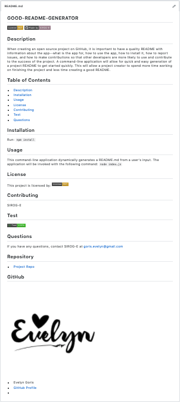

  ## **GOOD-README-GENERATOR**

  [](https://opensource.org/licenses/MIT)
  [](http://https://github.com/SIROG-E)  
  
  ## Description
  When creating an open source project on GitHub, it is important to have a quality README with information about the app--what is the app for, how to use the app, how to install it, how to report issues, and how to make contributions so that other developers are more likely to use and contribute to the success of the project. A command-line application will allow for quick and easy generation of a project README to get started quickly. This will allow a project creator to spend more time working on finishing the project and less time creating a good README.

  ## Table of Contents
  * [Description](#description)
  * [Installation](#installation)
  * [Usage](#usage)
  * [Preview](#preview)
  * [Website](#website)
  * [License](#license)
  * [Contributing](#contributing)
  * [Test](#tests)
  * [Questions](#questions)
  
  ## Installation

  Run: 

  ```
  npm install
  ```

  ## Usage

  This command-line application dynamically generates a README.md from a user's input. The application will be invoked with the following command: 

  ```
  node index.js
  ```
  
  
  <ul>

  <li> A quality, professional README.md is generated with the title of user's project and sections entitled Description, Table of Contents, Installation, Usage, License, Contributing, Tests, and Questions, when the user is prompted for information about his/her application repository. </li>
  <li> When the user enters project title, this is displayed as the title of the README file.</li>
  <li>After the user enters description, installation instructions, usage information, contribution guidelines, and test instructions, then this information is added to the sections of the README entitled Description, Installation, Usage, Contributing, and Tests.</li>
  <li>A badge is added hear the top of the README and a notice is added to the section of the README entitled License that explains which license the application is covered under, when  the user chooses a license for his/her application from a list of options.</li>
  <li>GitHub username is added to the section of the README entitled Questions, with a link to my GitHub profile.</li>
  <li>User's email address is added to the section of the README entitled Questions, with instructions on how to reach user with additional questions.</li>
  <li>The user is taken to the corresponding section of the README file, when the user clicks on the links in the Table of Contents.</li>
  <ul>


## Preview
 \
 \
<!--  -->

### Websites

[Good-README-Generator](https://sirog-e.github.io/Good-README-Generator/) 


  ## License
  This project is licensed by:\
[](https://opensource.org/licenses/MIT) 

  ## Contributing
  

  ## Test
   

  ## Questions
  If you have any questions, contact SIROG-E at goris.evelyn@gmail.com
  
  ## Repository
  - [Project Repo](https://sirog-e.github.io/Good-README-Generator/)
  
  ## GitHub
  
  - Evelyn Goris
  - [GitHub Profile](https://github.com/SIROG-E)
  - <null>